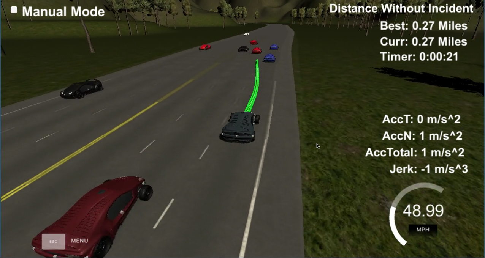

# write up -- CarND-Path-Planning-Project
Self-Driving Car Engineer Nanodegree Program

## The Task:
### Goals
In this project your goal is to safely navigate around a virtual highway with other traffic that is driving +-10 MPH of the
50 MPH speed limit. You will be provided the car's localization and sensor fusion data, there is also a sparse map list of 
waypoints around the highway. The car should try to go as close as possible to the 50 MPH speed limit, which means passing 
slower traffic when possible, note that other cars will try to change lanes too. The car should avoid hitting other cars at 
all cost as well as driving inside of the marked road lanes at all times, unless going from one lane to another. The car 
should be able to make one complete loop around the 6946m highway. Since the car is trying to go 50 MPH, it should take a 
little over 5 minutes to complete 1 loop. Also the car should not experience total acceleration over 10 m/s^2 and jerk that 
is greater than 10 m/s^3.

## how i did it:

As a basis i took the spline based approach that was mentioned in the Q&A Video. There a initial path is planed from a still standing car. During each iteration i take the previously calculated path (returned by the simulator) as a reference and only append some new way points in large distances. those are used to let the spline lib generate a more detailed but also very smooth path, till the path consits of NUM_WAYPOINTS (=75).

Once the simple lane changing example from the Q&A was working for me, i started to enhance it. 
Therefor i did several things.

First of all, i noticed that the simulator expects and returns most values in metric system (m/s). unfortunately however, for some reason that was NOT the case for the car_speed! that gave me some mind boggeling in the beginning, but was easy to fix by simply converting that speed into m/s. so finally i used the metric system for all my calculations.
I also introduced a simple struct 'Car' to make the sensor_fusion data (returned by the simulator) more easy to use. it's definition can be found in the lines 19-28.

Next step was to think about how to define the rules for the decission making. therefor i chose a simple state machine without any cost function. this turns out to work pretty well in most cases but is still not perfectly efficient. so for a real world application i would definitely add a cost function.
so the question for the needed states came up. i decided to go with the following states `KEEP_LANE`, `PLC`, `PLCR`, `PLCL`, `CLR`, `CLL`. Where 'PLCx' means 'Prepare Lane Change' with the x beeing a direction (left, right) and 'CLx' means 'Change Lane'.

the whole state transition can be found in the lines 201-358. it is pretty basic and quite some time went into fine tuning the details of those transitions. like choosing the right values for distances or setting the order in which those rules are checked and applied.
basically there are only a few ground rules:
1. don't hit other cars!
2. try to be as fast as possible, while obeying the law! for a takeover, prefer in order 
    1. empty lanes
    2. faster lanes
    3. lanes with more distant traffic.
  
when this order comes to play, it became obvious that a cost function might make the tansition more effective in specific situations. e.g. a car in lane 1 seems to be only a very litte bit faster than the one in line 2, while the car in line 2 is that far away, that i could optimally takeover both cars. but the rules simply prefer a faster car and thus stay behind the (very little) 'faster' car, which ends up in a pretty long ride behind another car. but still, the ride is safe, smooth and doesn't change lanes like a race driver. so depending on what we aim for, that might even be exactly what is needed! only the cost function might give us the opportunity to fine tune in more detail.

